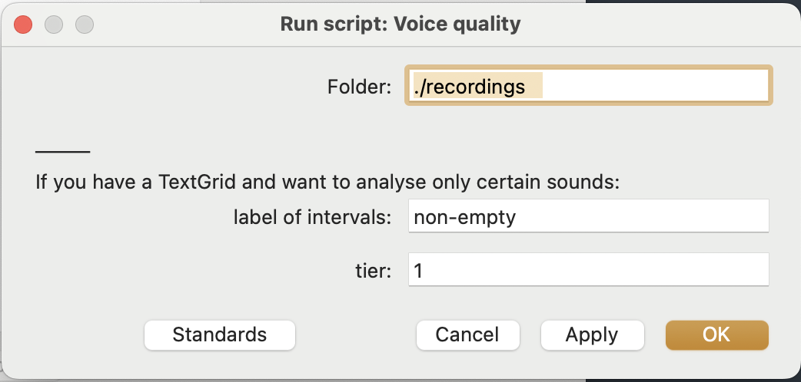

# Voice quality analysis
Script to analyze voice quality in Praat (jitter, shimmer, H1-H2, H1-A1, HNR, Spectral peak...)

This scripts runs through all the sounds in a folder and gets their f0, jitter, shimmer, harmonics to noise ratio, H1, H2 and H1-H2 difference.

The values are measures for the whole sound. Optionally if you have a Textgrid that matches the sound, the values will be extracted for all the intervals that match a label.

The output is a tab-separated file with a header like:

| Filename                 | Interval | Interval_label | duration | f0_mean | jitter | shimmer | HNR   | voice_breaks | locallyunvoiced | H1_dB  | H2_dB  | H1-H2 | H1-A1 | spectral_peak |
|--------------------------|----------|----------------|----------|---------|--------|---------|-------|--------------|-----------------|--------|--------|--------|------|-------------|
| wendy_healthy.wav        | 0        | -              | 12.73    | 213.461 | 0.046  | 0.063   | 12.86 | 2            | 0.03            | -34.53 | -54.93 | 20.40  | 10.61 | 248         |
| wendy_not_so_healthy.wav | 0        | -              | 14.91    | 154.503 | 0.063  | 0.138   | 13.04 | 0            | 0.14            | -25.86 | -33.79 | 7.93   | 4.23 | 165       |

This is the form:

> **Tip:** breathy → high H1-H2, high H1-A1;
	creaky → low H1-H2;
	jitter → f0 oscillation;
	shimmer → int. oscillation